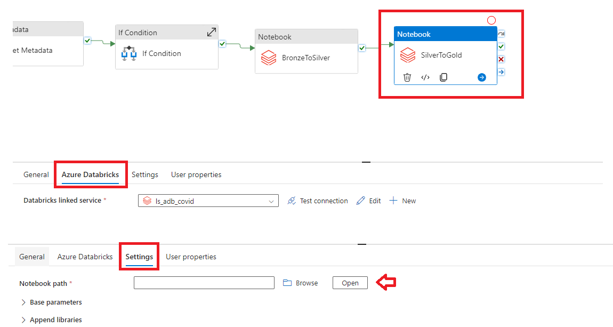

# Crear Azure ETL para Covid

  

# Servicios Utilizados
  

# Pipeline
  

# Activities
<h3 style="margin-left: 1em;">1. <strong>Validation</strong> : Valida la existencia de un archivo o carpeta en un origen de datos antes de continuar con el pipeline.</h3>
 

<h3 style="margin-left: 1em;">2. <strong>Get Metadata</strong> : Obtiene detalle de un archivo o carpeta, como su tamaño, si existe, columnas, etc.</h3>
 

<h3 style="margin-left: 1em;">3. <strong>If Condition</strong> : Permite realizar operaciones condicionales dentro de un pipeline.</h3>
 
 

<h3 style="margin-left: 1em;">4. <strong>Notebook (BronzeToSilver)</strong> : Realiza proceso de tranformacion de la capa bronze hacia silver, en la pestaña <strong>"Settings"</strong> asignamos la ruta del notebook.</h3>
 

<h3 style="margin-left: 1em;">5. <strong>Notebook (SilverToGold)</strong> : Realiza proceso de tranformacion de la capa silver hacia gold, en la pestaña <strong>"Settings"</strong> asignamos la ruta del notebook.</h3>
 

<h3 style="margin-left: 1em;">6. <strong>Notebook (ProcessAndML)</strong> : Realiza el proceso de entrenamiento con ML, en la pestaña  <strong>"Settings"</strong> asignamos la ruta del notebook.</h3>
 

<h3 style="margin-left: 1em;">7. <strong>CopyDataToDatawarehouse</strong> : Almacena los datos estructurados en datawarehouse, para este caso una base de datos.</h3>
 
 
 
 

<h3 style="margin-left: 1em;">8. <strong>Visualización PowerBI</strong> : Permite visualizar los datos en un reporte.</h3>
 
 
 
 
 
 
 

  

# Adicional
<h3 style="margin-left: 1em;"><strong>Key Vault</strong> : Creamos los secretos que seran utilizados en los linkedservices.</h3>
 

<h3 style="margin-left: 1em;"><strong>Triggers</strong> : Creamos un trigger, con una fecha y hora especifica que ejecutará automaticamente.</h3>
 
 

<h3 style="margin-left: 1em;"><strong>Insights</strong> : Creamos una alerta en monitorización datafactory.</h3>
 
 
 
 
 
<h3 style="margin-left: 1em;">- Si nos aparece el siguiente error debemos registrar insights a nuestra subscription.</h3>
 
<h3 style="margin-left: 1em;">- Si en el proceso de la condicion falla, enviará un correo.</h3>
 
 

 
<h3 style="margin-left: 1em;"><strong>Cost Mangement</strong></h3>
 